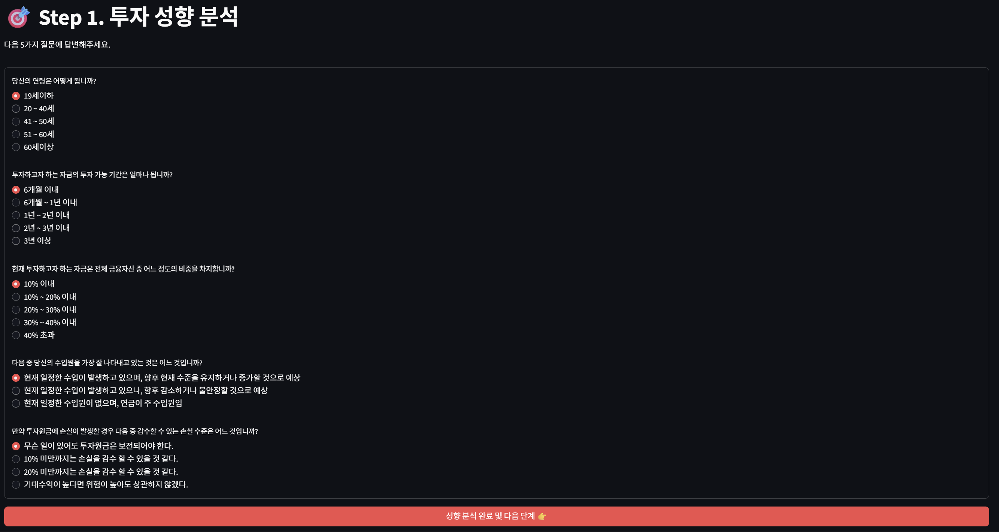
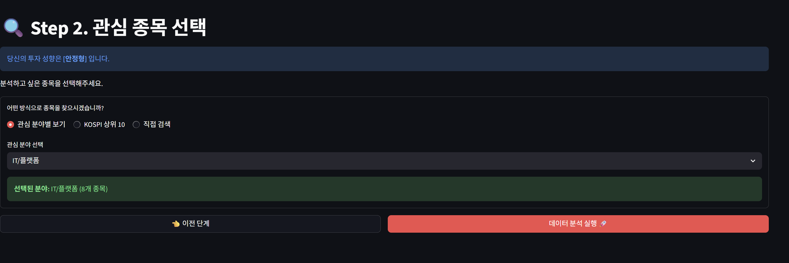
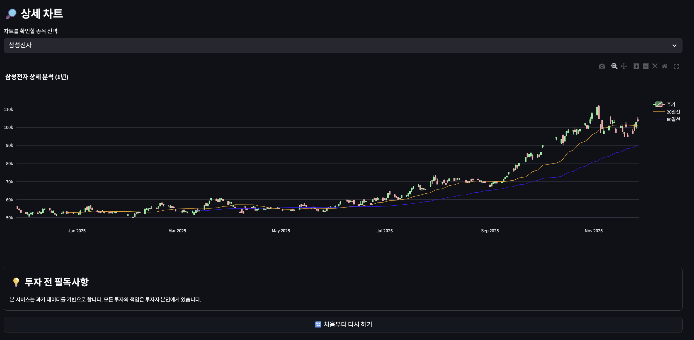

# Investment-Tendered-Stock-Analysis-Program
투자 성향 맞춤 주식 분석 프로그램

# 📈 투자 성향 맞춤 주식 분석 프로그램 (Investment-Tendered-Stock-Analysis-Program)

사용자의 투자 성향(연령, 자금, 위험 감수 등)을 5단계 설문으로 정밀하게 분석하고, 그에 맞는 최적의 **KOSPI/KOSDAQ** 주식 포트폴리오를 추천 및 심층 분석해주는 웹 애플리케이션입니다.

---

## 실행 화면

### Step 1 & Step 2: 성향 분석 및 종목 선택

|              **Step 1. 성향 분석**              |              **Step 2. 종목 선택**              |
| :---------------------------------------------: | :---------------------------------------------: |
|  |  |

### Step 3: 분석 결과 리포트

|            **수익률 비교 및 포트폴리오**            |             **상세 정보 및 재무 지표**              |              **상세 차트 및 유의사항**              |
| :-------------------------------------------------: | :-------------------------------------------------: | :-------------------------------------------------: |
|  |  |  |

---

##  주요 기능

### 1️⃣ 투자 성향 정밀 진단 (Step 1)

- 연령, 투자 기간, 자금 비중, 수입원, 손실 감수 수준 등 **5가지 핵심 문항**을 통해 사용자의 투자 성향을 분석합니다.
- **분류 유형:** `안정형` | `안정추구형` | `위험중립형` | `적극투자형`

### 2️⃣ 관심 종목 큐레이션 (Step 2)

- **테마별 선택:** 반도체, 2차전지, IT 플랫폼, 바이오 등 주요 섹터 종목 프리셋 제공
- **KOSPI 상위:** 시가총액 상위 우량주(Top 10) 자동 추천
- **직접 검색:** **PyKRX**를 활용하여 국내 상장 전 종목(KOSPI/KOSDAQ) 검색 지원

### 3️⃣ 심층 분석 리포트 (Step 3)

- **수익률 비교:** 선택한 종목들의 최근 3년간 주가 흐름 비교 (Normalized Line Chart)
- **재무 정보:** 최신 **PER, PBR, 배당수익률(DIV)** 데이터를 실시간으로 크롤링하여 제공
- **AI 이상치 탐지:** **Isolation Forest(비지도 학습)** 알고리즘을 활용하여 최근 7일 내 통계적 이상 급등락 감지
- **기술적 분석:** 20일/60일 이동평균선(MA)이 포함된 인터랙티브 캔들스틱 차트 제공 (**Plotly**)

---

## 🛠 사용 기술 (Tech Stack)

| Category          | Tech                                                                                       |
| :---------------- | :----------------------------------------------------------------------------------------- |
| **Language**      |           |
| **Framework**     |  |
| **Data Source**   | `yfinance` (글로벌 주가), `pykrx` (국내 재무 정보)                                         |
| **Analysis**      | `pandas`, `numpy`, `scikit-learn` (Isolation Forest)                                       |
| **Visualization** | `plotly`, `altair`                                                                         |

---

##  설치 및 실행 방법
이 프로젝트는 Python 3.8+ 환경에서 최적화되어 있습니다.

1. 저장소 클론

```Bash

git clone [https://github.com/Song-jaemin/Investment-Tendered-Stock-Analysis-Program.git](https://github.com/Song-jaemin/Investment-Tendered-Stock-Analysis-Program.git)
cd Investment-Tendered-Stock-Analysis-Program
```

2. 필수 라이브러리 설치

```Bash

pip install -r requirements.txt
```
3. 애플리케이션 실행

streamlit run project.py

📜 라이선스
이 프로젝트는 MIT License를 따릅니다.
